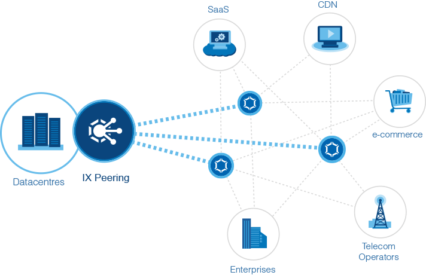

+++
title = "Sites Web à fort traffic"
weight = 5
#tags = ["golang", "programming", "theme", "hugo"]
#categories = ["programming","lorem","pseudo"]
banner = "img/banners/traffic.png"
#authors = ["John Doe"]
summary="En connectant votre réseau de serveurs web au point d'échange internet de Casablanca vous bénéficiez non seulement d'une proximité inégalée de vos utilisateurs chez les trois opérateurs mais vous vous connectez aussi aux..."

+++

En connectant votre réseau de serveurs web au point d'échange internet de Casablanca vous bénéficiez non seulement d'une proximité inégalée de vos utilisateurs chez les trois opérateurs mais vous vous connectez aussi aux réseaux de distribution de contenu (CDNs) qui sont membres aussi de l'IXP.

En peerant avec les opérateurs télécom et les CDNs vous gardez l'intégralité de votre traffic internet au Maroc et atteignez ainsi des temps d'accès optimaux de l'ordre de quelques milisecondes uniquement.
